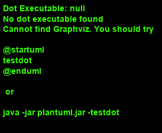

# Prosjekt og deltager

https://travis-ci.com/Westerdals/pgr203-assignment-3-iaffs

<En kort forklaring på hva dette prosjektet inneholder>

## Usage

1. <Før man bygger prosjektet er det anbefalt å kjøre mvn clean for å sørge for å ha en "ren database". For å bygge prosjektet må man kjøre mvn package shade:shade>
2. <For å kjøre jar-filen, må man kjøre java -jar target/task-manager-1.0-SNAPSHOT-shaded.jar>
3. <Man oppretter en ny prosjektdeltager ved å trykke på angitt tall i interface'et, og det samme gjelder hvilket prosjekt man ønsker å legge prosjektdeltageren til>
 
 ## Design (valgfritt)
 

 ## Implementation notes
 
<Hva gjorde dere godt i implementasjonen>

<Hva følte dere at dere ikke fikk til i implementasjonen>

## Link to review

* link to issue you registered in other group's github repository
